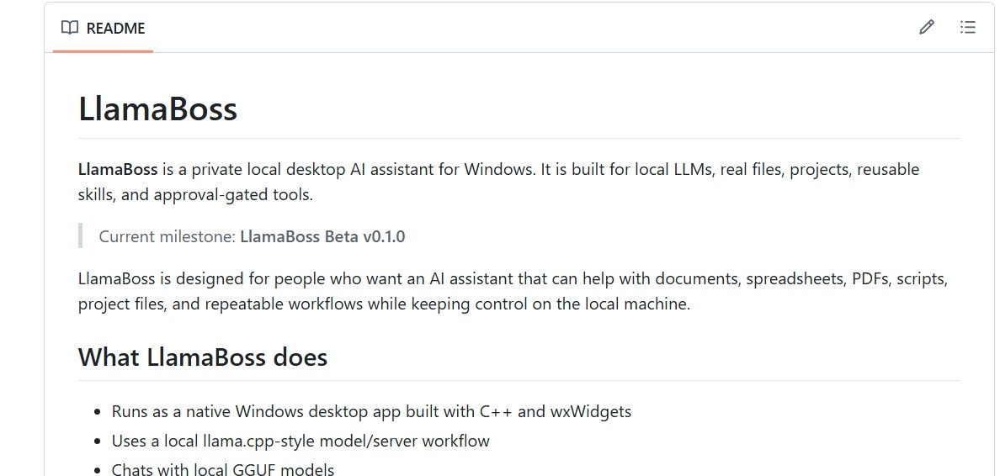

# LlamaBoss

**LlamaBoss** is a private local desktop AI assistant for Windows. It is built
for local LLMs, real files, projects, reusable skills, and approval-gated
tools.

> Current milestone: **LlamaBoss Beta v0.1.0**

<p align="center">
  
</p>

LlamaBoss is designed for people who want an AI assistant that can help with
documents, spreadsheets, PDFs, scripts, project files, and repeatable workflows
while keeping control on the local machine.

## What LlamaBoss does

- Runs as a native Windows desktop app built with C++ and wxWidgets
- Uses a local llama.cpp-style model/server workflow
- Chats with local GGUF models
- Imports and works with local files
- Creates per-chat workflow folders for generated artifacts
- Supports long-lived Projects with their own files, notes, sources,
  templates, outputs, and workflows
- Supports reusable global Skills for cross-project procedures
- Uses approval cards before risky actions such as script creation, script
  execution, deletion, package installation, and other controlled write
  operations
- Provides helper tools for common office-style work: CSV, XLSX, PDF, DOCX,
  Python scripts, notes, and file operations

## Beta status

LlamaBoss is currently beta software. The core direction is stable, but feature
names, workflows, file handling, installer behavior, and UI details may change
before a stable release.

Use caution with important files. LlamaBoss is intentionally built around
approvals and local-first control, but beta builds should still be tested on
copies of important documents.

## Current feature areas

### Local chat

- Native desktop chat UI
- Streaming responses
- Conversation history
- Markdown-style rendering
- File attachment support
- Per-chat workspace folders
- Conversation deletion with associated workflow-folder cleanup

### Projects

Projects are long-lived folders under the user's LlamaBoss directory. A project
can include:

```text
Projects/<Project Name>/
  PROJECT.md
  project.json
  Sources/
  Templates/
  Notes/
  Outputs/
  Workflows/
```

Project support includes:

- Create, attach, switch, and delete projects
- Move existing chats into projects
- Load project instructions from `PROJECT.md`
- Use project source files as durable reference material
- Keep generated chat artifacts separate from long-lived project files
- Save project-specific notes to `Notes/NOTES.md`

### Skills

Skills are reusable global workflows stored under the LlamaBoss Skills folder.
A Skill is usually a Markdown `.workflow.md` contract and may optionally
include a same-stem Python helper script.

Skills are intended for repeatable procedures that should be available across
projects, such as:

- File conversion workflows
- Report generation workflows
- Recurring document cleanup steps
- Office automation patterns
- Reusable prompts and tool procedures

### Notes

LlamaBoss has both global notes and project notes.

- Global notes live in the user's LlamaBoss root as `NOTES.md`
- Project notes live inside the active project as `Notes/NOTES.md`
- When a project is active and the user asks to save something to notes,
  LlamaBoss saves the full note in the project notes and adds a compact
  pointer in global notes

### Tools and approvals

LlamaBoss includes a structured tool system with approval-aware execution.

Tool areas include:

- File read, list, open, grep, write, edit, mkdir, and delete
- Controlled PowerShell commands
- Python health checks
- Python script creation and execution
- CSV inspection and report generation
- XLSX inspection and report generation
- PDF text extraction, PDF form inspection, and PDF form filling
- DOCX text extraction and inspection
- Global and project notes

Riskier actions are gated by approval cards so the user can review what is
about to happen before allowing it.

### Python helpers

Python is used for document and office automation tasks that are better handled
by scripts than by C++ directly.

Current Python-oriented capabilities include:

- Create reviewable Python scripts
- Run approved scripts from controlled LlamaBoss locations
- Generate artifacts from scripts
- Inspect and report on CSV/XLSX files
- Extract text from PDFs and DOCX files
- Fill PDF forms when fields are available
- Install allowlisted helper packages after approval

## Default local folders

LlamaBoss uses a local user folder similar to:

```text
%USERPROFILE%\LlamaBoss\
  Workspace\
  Documents\
  Spreadsheets\
  PDFs\
  Scripts\
  Downloads\
  Workflows\
  Projects\
  Skills\
  NOTES.md
```

Per-chat artifacts are stored in conversation-specific workflow folders such
as:

```text
%USERPROFILE%\LlamaBoss\Workflows\chat_<id>\Workspace\
```

## Requirements

- Windows 10/11 x64
- A compatible local GGUF model
- llama.cpp runtime support, either bundled by a release build or configured
  locally
- Python 3 for Python helper features
- Optional Python packages for specific helpers, such as `openpyxl`, `pymupdf`,
  and `python-docx`

## Building from source

### Prerequisites

- Visual Studio 2022 or newer with the Desktop development with C++ workload
- C++17 support
- vcpkg manifest mode

### Dependencies

Dependencies are managed through `vcpkg.json` and may include:

- wxWidgets for the native UI
- Poco for JSON, networking, and utility support

### Build steps

```powershell
git clone https://github.com/Littleczr/llamaboss.git
cd llamaboss
```

Open `LlamaBoss.slnx` or `LlamaBoss.vcxproj` in Visual Studio, restore
dependencies through vcpkg, then build the Release x64 configuration.

## Suggested first tests

After building or installing a beta build, try:

```text
Ask a normal chat question
Create a project
Attach the project to a chat
Save a note while the project is active
Import a PDF and extract text
Create a small Python script
Approve and run the script
Create a Skill
Run the Skill from a new chat
Delete a test chat and confirm the chat workflow folder is cleaned up
```

## Roadmap

Near-term focus:

- Polish the Projects and Skills workflow experience
- Improve model download and runtime setup UX
- Tighten approval and artifact handling edge cases
- Improve installer reliability
- Add stronger project/workflow onboarding
- Continue improving local document automation

Longer-term ideas:

- SQLite-backed local memory, history, artifacts, and audit trail
- Better Skills packaging and sharing
- Theme sharing through llamaboss.com
- Expanded local model catalog
- Optional website summarization and web-follow-up tools
- More advanced typed tool calling and workflow execution

## Privacy and safety direction

LlamaBoss is designed around local-first operation, user-visible files, and
approval-based actions. The goal is to make useful local automation approachable
without hiding what the assistant is doing.

## License

MIT

## Author

Created by Cesar Avelar.

Website: llamaboss.com
